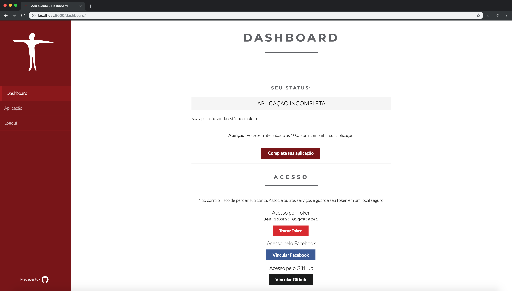
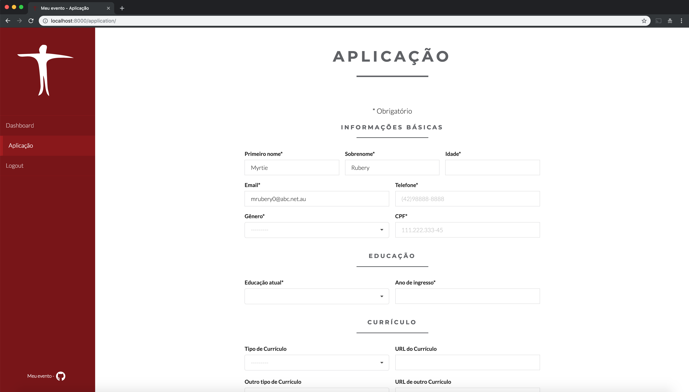
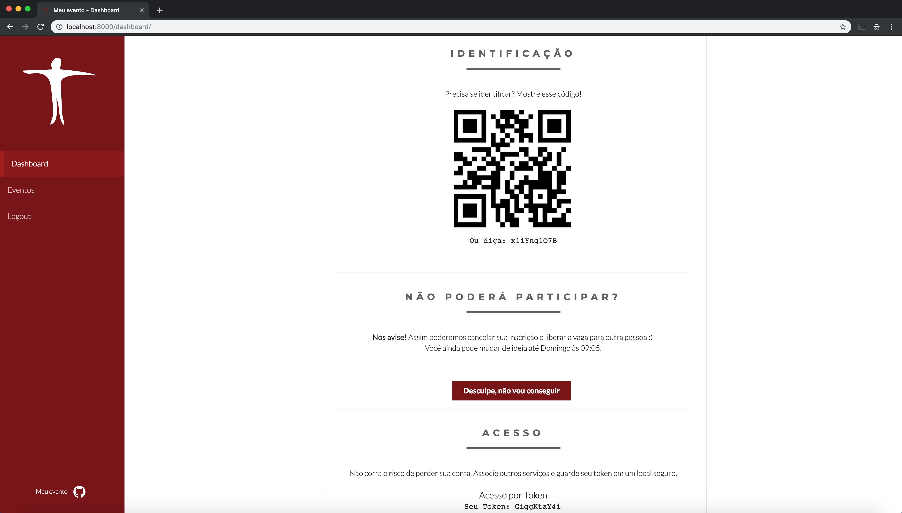
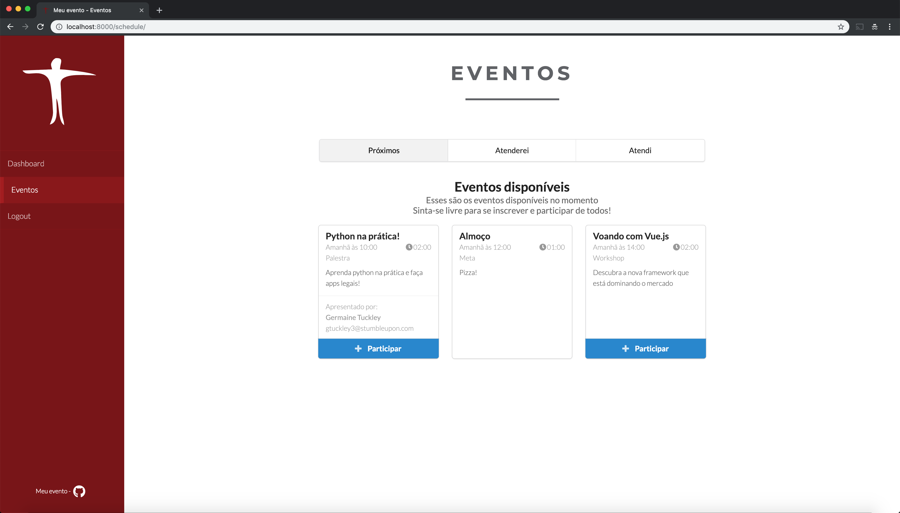
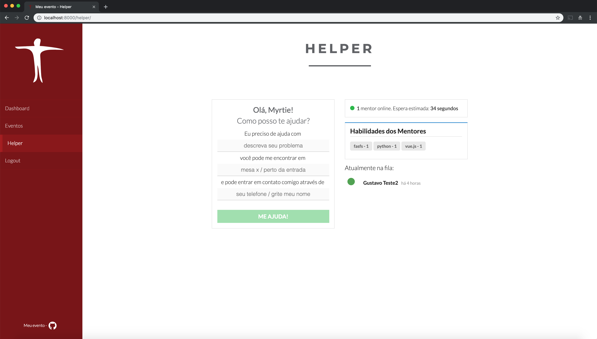
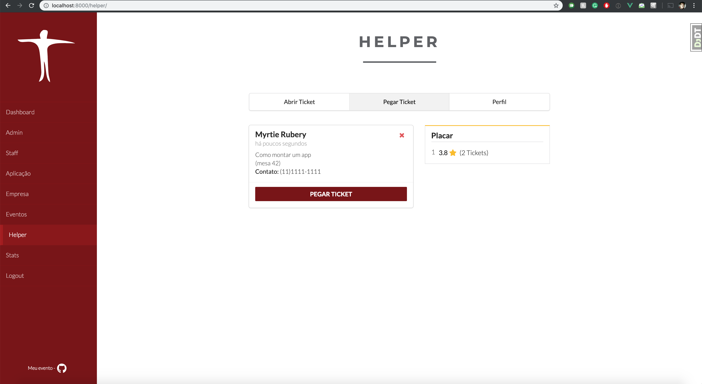
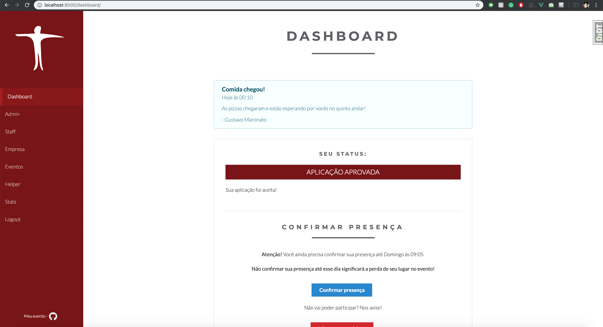
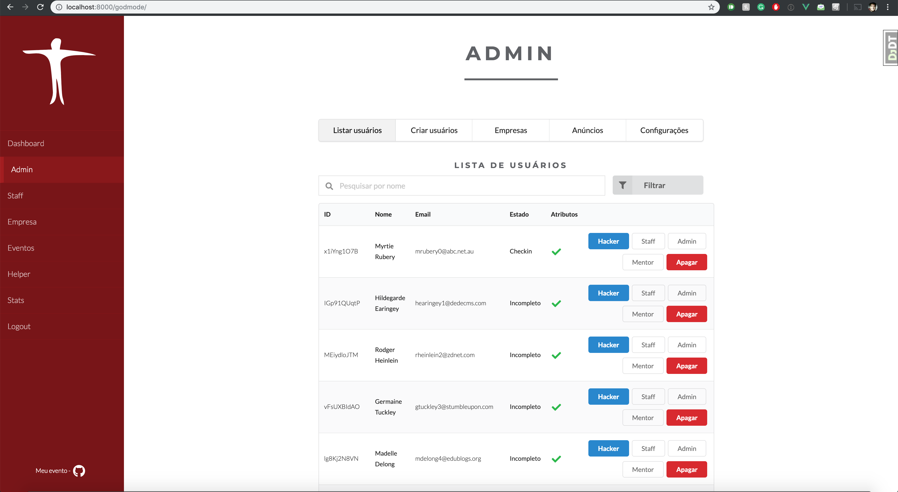
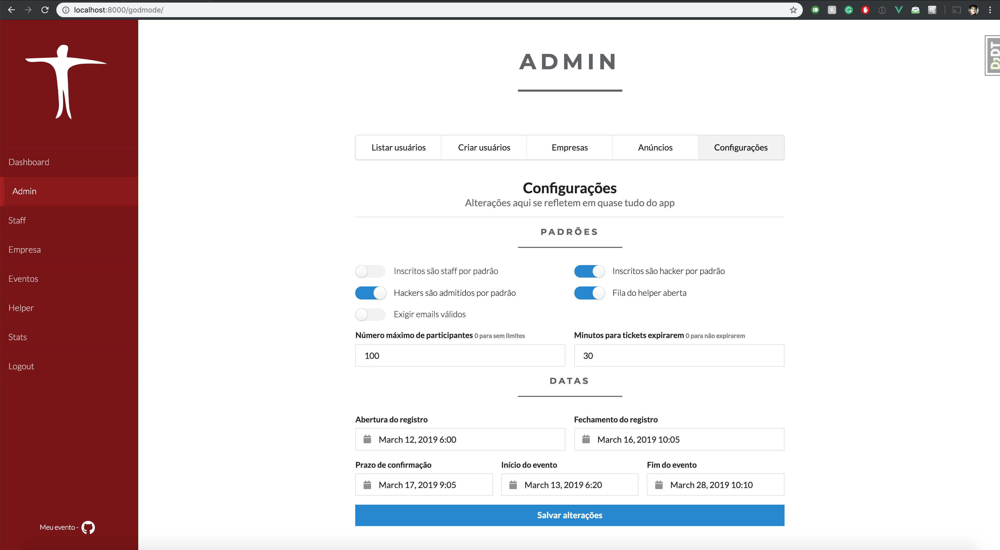

[](https://travis-ci.com/TalentoUnicamp/my)

# Event Manager
Tudo pro seu evento, feito em Django e Vue.js

Event Manager é um sistema feito para gerenciar _quase_ tudo do seu evento por você. Ele vai ser toda a sua infraestrutura virtual antes e durante o evento, unificando suas inscrições, checkin envio de emails, mini-eventos como palestras durante seu evento maior e muito mais! Pros seus usuários, é uma plataforma unificada e limpa que vai substituir diversos outros sistemas independentes e ruins.


# Features
O Event Manager vem com várias features prontas pra serem usadas. Algumas delas são:
- *Inscrição*:
    - Formulários de inscrição personalizável
    - Envio de emails e lembretes automáticos
    - Redistribuição de vagas automáticas por desistência
    - Aprovação automática ou seleção manual de participantes
    - Janelas de tempo para inscrição e confirmação de presença
- *Integrações*:
    - Integração com Facebook, Github e Google
    - Importação automática de dados das redes sociais
    - Integrações com mais de 20 serviços de analytics, incluindo o Google Analytics
- *Check in*:
    - Check in de participantes com QR code pelo celular
    - Opção de inscrever participantes manualmente durante o evento, depois da janela de inscrição
- *Sub Eventos*:
    - Gerenciamento automático de sub eventos (palestras, workshops, etc)
    - Eventos podem ter limite de participantes e requerir inscrição
    - Equipe pode fazer check in dos participantes nos eventos para garantir que só quem se inscreveu poderá entrar
    - Participantes podem avaliar eventos depois e enviar feedback
    - Palestrantes podem ser vinculados a eventos para lerem o feedback
- *Helper*:
    - Plataforma completa para geração e controle de tickets de ajuda
    - Mentores e staff pegam tickets de participantes/outros staffs
    - Participantes avaliam mentores após o evento
- *Patrocinadores*:
    - Patrocinadores podem ter contas especiais na plataforma
    - Podem escanear o QR code de participantes que forem interessantes para manter contato no futuro
    - Algumas áreas do sistema podem ser restritas a apenas alguns patrocinadores
- *Anúncios*:
    - Anúncios e avisos podem ser criados durante o evento
    - Ficam visíveis em todas as telas para todos os participantes
- *Estatísticas*:
    - Histogramas interativos de inscrições ao longo do tempo
    - Estatísticas dos inscritos e dos dados preenchidos no formulário de inscrição
    - Estatísticas linguísticas dos campos de texto do formulário
- *Exportações*:
    - Todos os dados podem ser exportados em 8 formatos diferentes

### Na próxima versão:

- *Equipes*:
    - Participantes podem criar equipes entre si
    - Podem submeter seu código para avaliação dos jurados
- *Jurados*:
    - Jurados podem avaliar equipes
    - Mecanismo de avaliação segue um algoritmo de comparação entre pares, mais preciso e intuitivo que avaliações quantitativas
    - Avaliação dos jurados é individual entre o jurado e a equipe
    - O sistema envia jurados para mesas das equipes automaticamente e cuida de calcular as pontuações e montar o ranking=

# Interface
## Dashboard


Depois de fazerem seu login pela primeira vez, o participante terá acesso ao Dashboard. Nele, é possível acompanhar seu status atual e outras coisas, como vincular redes sociais para login, confirmar presença e acessar seu QR code de identificação.

Os status que o participante podem ter variam entre:
- Incompleto: A aplicação ainda não foi preenchida, mas ainda está dentro do prazo
- Confirmar email: A aplicação foi preenchida, mas o participante ainda não confirmou seu email
- Submetido: A aplicação foi submetida, mas ainda não foi avaliada pela equipe do evento
- Admitido: A equipe do evento aprovou a participação
- Negado: A equipe do evento negou a participação
- Fila de espera: A equipe aprovou a participação, mas o evento já está cheio. No caso de desistência, novas vagas serão distribuídas
- Confirmado: O participante foi aprovado e confirmou que irá aparecer no evento
- Desistência: O participante foi aprovado, mas desistiu de sua vaga
- Atrasado: O prazo de preenchimento da aplicação já passou e o participante não a preencheu
- Check in: O check in no evento foi realizado

## Aplicação


O formulário de aplicação é personalizável no código.

## Identificação

Após confirmar sua presença, o participante receberá um QR code que o identifica no evento. Esse QR code servirá para fazer o check in no evento principal, nos sub eventos, ser escaneado por patrocinadores, etc

Ele fica sempre disponível na sua Dashboard

## Sub eventos

Também após confirmar sua presença, o participante terá acesso à tela de inscrição nos sub eventos. Nela é possível ver informações sobre todos os sub eventos que acontecerão e é possível se inscrever para eles.

Após participar do sub evento, o participante poderá avaliar este e fornecer feedback ao palestrante

## Mentoria

Dentro do evento será aberta a plataforma de tickets de ajuda. Nela, participantes ou membros da equipe podem abrir tickets que serão pegos por outros membros da equipe e por mentores.

Com tickets, participantes nunca terão que ir atrás de mentores e membros da equipe. Basta submeter sua dúvida e ela estará imediatamente disponível para ser pego. Isso reduz o tempo para solução de dúvidas e estimula que participantes façam perguntas.


Mentores e administradores têm acesso à lista de tickets abertos e podem facilmente pegá-los. Após solucionar tickets, os participantes poderão avaliar a ajuda que receberam e esses dados vão para um ranking de mentores.

## Anúncios

Adminstradores podem criar mensagens de anúncio a qualquer momento do evento e enviar para os usuários. Estas aparecerão no topo de todas as páginas da plataforma a todo momento.

## Administradores

Os administradores têm acesso a uma interface clara para gerenciamento dos usuários ao longo do evento. Podem facilmente atribuir ou remover títulos, remover usuários, criar vários usuários de uma vez, criar anúncios, criar empresas patrocinadoras e associar seus empregados e gerenciar as configurações gerais do evento.

É possível alterar várias configurações do evento em tempo real, como número de participantes, datas de abertura das inscrições e do evento e muito mais.

# Setup
## Pré requisitos
Event Manager requer os seguintes softwares:

|Software                           |Versão |
|-----------------------------------|-------|
|[Python](https://www.python.org/)  |3.7+   |
|[Node](https://nodejs.org/en/)     |10+    |
|[Redis](https://redis.io/)         |5.0.3+ |

## Rodando localmente
Depois de instalados Python e Node, você deverá instalar as dependências deles. Para isso, rode:
```
pip install -r requirements.txt
```
Para instalar as dependências de Python, e
```
npm install
```
para instalar as dependências do Node.

Depois disso você deverá configurar as variáveis do sistema. Para fazer login social, tenha em mãos as chaves de aplicativos oauth do Facebook, Github ou Google. Para salvar os arquivos estáticos na S3 da AWS, tenha em mãos as credenciais de um usuário IAM com permissão para o S3 e o nome de um bucket válido.

Para que o sistema envie emails, você deverá fornecer uma conta de email válida a ser utilizada. O sistema está pré configurado para usar gmail, mas você pode mudar o host e porta no arquivo de variáveis depois.

Para configurar o arquivo de variáveis `.env`, rode
```
python initialize.py
```
e responda às perguntas.

Depois disso você precisará configurar o banco de dados. O padrão é o sqlite3, mas você pode mudar a URL do banco no arquivo `.env`.
Para criar as tabelas no banco, rode
```
python manage.py migrate
```
Agora, para criar o usuário administrador inicial, rode
```
python manage.py createsuperuser
```

Para inicializar o servidor, rode
```
./run.sh
```

Esse comando executa 3 comandos diferentes em sequência:
```
python manage.py runserver
```
Para iniciar o servidor. Pode ser substituído por `daphne project.asgi:application` para simular o ambiente em produção.
```
redis-server
```
Para iniciar o redis.
```
celery -A project worker -l info
```
Para iniciar o celery worker.

Com o servidor rodando, você precisará fazer login na conta de admin, mas ainda não possui vínculo à sua rede social. Por isso, você precisará acessar usando o painel de admin do Django. Faça isso acessando `http://localhost:8000/admin/` e fazendo o login. Depois disso você pode voltar para `http://localhost:8000/` e configurar seu evento.

Você vai perceber que o site é meio lento. Isso é por design e acontece apenas durante o desenvolvimento local.

## Rodando na nuvem
Para ter o sistema rodando rapidamente no Heroku, basta clicar no botão abaixo e preencher o formulário de variáveis
[](https://heroku.com/deploy)

# Personalizando para o seu evento
coming soon

# License
Copyright (c) 2019 Gustavo Maronato (https://github.com/maronato). Released under AGPLv3. See LICENSE.txt for details.
